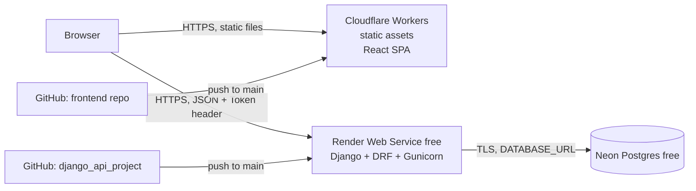

# 01 — Architecture

> Part of the [project docs](README.md). Last updated: 2026-10-09.

## Goals

1. Demonstrate **Python/Django REST API** skills (this repo) and **React** skills (separate frontend repo) as one coherent, deployed product.
2. Run both in **production on free tiers**, with HTTPS, environment-based config, and a managed database.
3. Keep it simple enough to maintain alone, but production-shaped enough to discuss in an interview: env vars, CORS, token auth, migrations, CI, a typed API contract.

**Non-goals (for now):** custom domains, paid tiers, autoscaling, server-side rendering, real user registration.

## Target architecture

| Layer | Technology | Host (free) | URL (placeholder) |
|---|---|---|---|
| Frontend | React + Vite + TypeScript SPA | Cloudflare Workers (static assets) | `https://<frontend>.<account>.workers.dev` |
| Backend | Django 5.2 LTS + DRF + Gunicorn + WhiteNoise | Render free web service | `https://<backend>.onrender.com` |
| Database | PostgreSQL | Neon free | `postgresql://...neon.tech/...?sslmode=require` |
| API docs | drf-spectacular (Swagger/Redoc) | served by backend | `https://<backend>.onrender.com/api/schema/swagger-ui/` |

## Decision log

| # | Decision | Chosen | Alternatives considered | Reason |
|---|---|---|---|---|
| D1 | Frontend host | Cloudflare Workers static assets | Cloudflare Pages, Vercel, Netlify | Free, no cold start, global CDN, SPA fallback built in. Cloudflare steers new projects to Workers over Pages. |
| D2 | Backend host | Render free | Cloudflare Python Workers, PythonAnywhere, Koyeb | Git-push deploys, native Python runtime, no Docker required. Python Workers only reached GA in Sept 2026 and would mean more debugging; PythonAnywhere looks less production-like; Koyeb now requires a card. |
| D3 | Database | Neon Postgres | Render Postgres, SQLite | Render's free disk is ephemeral, so SQLite loses data on every deploy. Render's free Postgres expires after 30 days. Neon's free tier does not expire. |
| D4 | Auth for the SPA | DRF Token auth in `Authorization` header | Session cookies, JWT | Frontend and backend live on **different sites** (`workers.dev` vs `onrender.com`), and browsers block third-party cookies, so cookie sessions are fragile. Token auth already exists in the project. JWT adds complexity with no benefit here. |
| D5 | Read access | Public reads, authenticated writes | Everything authenticated | Reviewers can browse the demo without logging in. A shared demo account unlocks CRUD. |
| D6 | API contract | OpenAPI (drf-spectacular), TypeScript types generated from it | Hand-written types | Single source of truth. Shows contract-first thinking. |
| D7 | Packaging & runtime | uv (`pyproject.toml` + `uv.lock`) on Render's native Python runtime, no Docker | pip + `requirements.txt`, Dockerfile on `feature/add-container` | One lockfile for local and production, fast installs, no pip inside the venv ([#1](https://github.com/pirrozani/django-api/issues/1)). Docker adds nothing on Render's free tier. |

## Free-tier constraints to design around

| Constraint | Impact | Mitigation |
|---|---|---|
| Render free sleeps after ~15 min idle, and waking takes up to ~1 min | First request of a demo is slow | `GET /api/health/` (BE-06). Frontend pings it on load and shows a "Waking up the server…" banner (FE-08). |
| Render free has no persistent disk | SQLite and uploaded files are lost on deploy | Postgres on Neon ([#5](https://github.com/pirrozani/django-api/issues/5)). No file uploads in scope. |
| Render free: no shell / one-off jobs | Can't run `createsuperuser` or `populate` on the server | Run management commands **locally** against the Neon `DATABASE_URL` (OPS-03). |
| Neon free scales compute to zero when idle | Small extra latency on first query | `CONN_HEALTH_CHECKS=True`, modest `CONN_MAX_AGE`. |
| Shared demo account can delete data | Demo can be vandalized | `reset_demo` command ([#6](https://github.com/pirrozani/django-api/issues/6)), run manually or nightly (OPS-05). |

> Free-tier limits change often. Re-check Render, Neon and Cloudflare pricing pages before relying on exact numbers.
