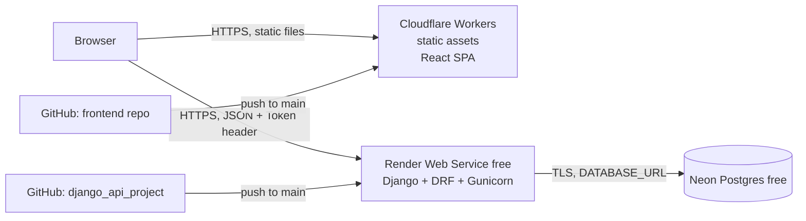

# Architecture Plan — Django REST API + React SPA (free-tier production)

> **Status:** Draft v1 · **Date:** 2026-10-08
> **Purpose:** Master plan for turning `django_api_project` into the backend of a full-stack portfolio project, and for building a new React frontend in a separate repository. Each work item below has a stable ID (`BE-xx`, `FE-xx`, `OPS-xx`) so it can be expanded into its own doc, issue, or PR.

---

## 1. Goals

1. Demonstrate **Python/Django REST API** skills (the existing repo) and **React** skills (new repo) as one coherent, deployed product.
2. Run both in **production on free tiers**, with HTTPS, environment-based config, and a managed database.
3. Keep the setup simple enough to maintain alone, but production-shaped enough to discuss in an interview: env vars, CORS, token auth, migrations, CI, typed API contract.

**Non-goals (for now):** custom domains, paid tiers, autoscaling, server-side rendering, real user registration.

---

## 2. Target architecture



| Layer | Technology | Host (free) | URL (placeholder) |
|---|---|---|---|
| Frontend | React + Vite + TypeScript SPA | Cloudflare Workers (static assets) | `https://<frontend>.<account>.workers.dev` |
| Backend | Django 5.2 LTS + DRF + Gunicorn + WhiteNoise | Render free web service | `https://<backend>.onrender.com` |
| Database | PostgreSQL | Neon free | `postgresql://...neon.tech/...?sslmode=require` |
| API docs | drf-spectacular (Swagger/Redoc) | served by backend | `https://<backend>.onrender.com/api/schema/swagger-ui/` |

### 2.1 Why this stack (decision log)

| # | Decision | Chosen | Alternatives considered | Reason |
|---|---|---|---|---|
| D1 | Frontend host | Cloudflare Workers static assets | Cloudflare Pages, Vercel, Netlify | Free, no cold start, global CDN, SPA fallback built in. Cloudflare steers new projects to Workers over Pages. |
| D2 | Backend host | Render free | Cloudflare Python Workers, PythonAnywhere, Koyeb | Git-push deploys, native Python runtime, zero Docker required. Python Workers only reached GA in Sept 2026 and would mean more debugging; PythonAnywhere looks less production-like; Koyeb now requires a card. |
| D3 | Database | Neon Postgres | Render Postgres, SQLite | Render's free disk is ephemeral, so SQLite loses data on every deploy. Render's free Postgres expires after 30 days. Neon's free tier does not expire. |
| D4 | Auth for the SPA | DRF Token auth in `Authorization` header | Session cookies, JWT | Frontend and backend live on **different sites** (`workers.dev` vs `onrender.com`), and browsers block third-party cookies, so cookie sessions are fragile. Token auth already exists in the project. JWT adds complexity with no benefit here. |
| D5 | Read access | Public reads, authenticated writes | Everything authenticated | Reviewers can browse the demo without logging in. A shared demo account unlocks CRUD. |
| D6 | API contract | OpenAPI (drf-spectacular), TypeScript types generated from it | Hand-written types | Single source of truth. Shows contract-first thinking. |
| D7 | Container | Render native Python runtime | Dockerfile (on `feature/add-container`) | Simpler on Render. The existing Dockerfile runs `runserver` and `populate` on every boot, which is not production-safe. The Dockerfile can still be fixed later for local dev. |

### 2.2 Free-tier constraints to design around

| Constraint | Impact | Mitigation |
|---|---|---|
| Render free sleeps after ~15 min idle, and waking takes up to ~1 min | First request of a demo is slow | `GET /api/health/` endpoint (BE-06). Frontend pings it on load and shows a "Waking up the server…" banner (FE-08). |
| Render free has no persistent disk | Uploaded files and SQLite are lost on deploy | Postgres on Neon. No file uploads in scope. |
| Render free: no shell / one-off jobs | Can't run `createsuperuser` or `populate` on the server | Run management commands **locally** against the Neon `DATABASE_URL` (OPS-03). |
| Neon free scales compute to zero when idle | Small extra latency on first query | `CONN_HEALTH_CHECKS=True`, modest `CONN_MAX_AGE`. |
| Shared demo account can delete data | Demo can be vandalized | Reset command: `clear` + `populate` (BE-09), run manually or on a schedule (OPS-05, optional). |

> Free-tier limits change often. Re-check Render, Neon and Cloudflare pricing pages before relying on exact numbers.

---

## 3. Current backend state (audit, 2026-10-08)

Repo: `django_api_project` · branch `develop` · Django 5.0.2 · DRF 3.14 · drf-spectacular 0.27 · SQLite.

### 3.1 Domain model

| Model | Fields | Notes |
|---|---|---|
| `api.User` | `id, first_name, last_name, username, mobile, password, email (unique), register_at` | A **content model** (blog authors). It is **not** Django's auth user. |
| `api.Blog` | `id, user (FK → api.User, cascade), title, content, created_at (date)` | |
| `auth.User` (Django built-in) | — | The **login account** used by Token/Basic auth. A token is auto-created by `api/signals.py`. |

> ⚠️ **Two different "users".** API consumers log in with a Django `auth.User`; the `/api/users/` resource manages `api.User` records (authors). Keep this distinction explicit in the frontend (the UI may call them **"Authors"**). Renaming the model is optional and out of scope for v1 (see §9 Q3).

### 3.2 Current endpoints (`api/urls.py`, mounted at `/api/`)

| Method | Path | Current response | Auth |
|---|---|---|---|
| GET | `/api/users/` | `{"Total": n, "Users": [...]}` | required |
| POST | `/api/users/` | `{"Users": {...}}` (201) | required |
| GET/PUT/DELETE | `/api/users/<id>` | object / object / `{"message": ...}` with 204 | required |
| GET | `/api/blogs/` | `{"Total": n, "Blogs": [...]}` | required |
| POST | `/api/blogs/` | `{"Blogs": {...}}` (201) | required |
| GET/PUT/DELETE | `/api/blogs/<id>` | object / object / empty 204 | required |
| GET | `/api/blogs/user/<user_id>` | `{"Total", "Blogs"}`, or **404 when the user has no blogs** | required |
| GET | `/api/schema/`, `/api/schema/swagger-ui/`, `/api/schema/redoc/` | OpenAPI | public |
| — | `/admin/` | Django admin | session |

### 3.3 Issues that block or weaken the frontend/deploy

| ID | Issue | Location | Severity |
|---|---|---|---|
| A1 | **No token-issuing endpoint.** The SPA can't log in. | `api/urls.py` | Blocker |
| A2 | **No CORS.** Browser blocks cross-origin calls. | `settings.py` | Blocker |
| A3 | **SQLite only.** Data is lost on Render. | `settings.py` `DATABASES` | Blocker |
| A4 | No `gunicorn`, `whitenoise`, `STATIC_ROOT`, Postgres driver. | `pyproject.toml`, `settings.py` | Blocker |
| A5 | `clear` command uses `sqlite_sequence`, so it **fails on Postgres**. | `django_api/management/commands/clear.py` | Blocker for demo reset |
| A6 | **Password hash exposed** in responses (`fields='__all__'`) and **stored in plain text** on create/update via API. | `api/serializers/user_serializer.py` | Security |
| A7 | `BasicAuthentication` is listed first, so a 401 returns `WWW-Authenticate: Basic`, which can trigger the browser's native login popup. | `settings.py` `REST_FRAMEWORK` | UX |
| A8 | Inconsistent response shapes: wrapped plural keys on list/create (`{"Blogs": {...}}` for a single object), `message` vs DRF `detail`, 204 with a body, and 404 for an empty list. | views | API quality |
| A9 | No pagination or ordering on lists. | views | Scalability/UX |
| A10 | Blog responses only include the author's `user` id, so the frontend needs N+1 calls to show author names. | `BlogSerializer` | UX/perf |
| A11 | The `UserSerializer.__init__` PUT hack is dead code (views never pass `request_method` in context). PUT requires all fields. | serializer + views | Correctness |
| A12 | Junk dependency `django-rest-framework==0.1.0` (the real package is `djangorestframework`). Resolved in #1. | `requirements.txt` (removed in #1) | Hygiene |
| A13 | Django 5.0 no longer receives security fixes. | `pyproject.toml` | Security |
| A14 | `DoesNotExist = None` / `objects = None` class attributes on models (IDE workaround). | `api/models/*.py` | Hygiene |
| A15 | No tests (`api/tests.py` is empty). README is "Upcoming...". | — | Portfolio quality |

### 3.4 Unmerged work worth reusing

| Branch | Contents | Action |
|---|---|---|
| `feature/update-user_serializer` | `password` write-only, hashed on create, explicit fields, `PASSWORD_HASHERS` | **Merge into `develop` first** (part of BE-04), then extend to hash on update too. |
| `feature/add-container` | Above + `Dockerfile`/`.dockerignore` (runs `runserver` + `populate` on boot) | Don't use for production. Optionally fix later for local dev. |

---

## 4. Target API contract (v2)

The frontend has no consumers yet, so it is safe to standardize the contract now. Bump `SPECTACULAR_SETTINGS['VERSION']` to `2.0.0`.

### 4.1 Conventions

- JSON only. Errors use DRF's default shape: `{"detail": "..."}` or field errors `{"field": ["msg"]}`.
- Lists are paginated: `{"count", "next", "previous", "results": [...]}` · `?page=N` · page size 10 (configurable `?page_size=` up to 50).
- `POST` returns **201 + the created object** (unwrapped). `DELETE` returns **204 with empty body**.
- `PATCH` supported for partial updates; `PUT` stays as a full replace.
- Default ordering: newest first (`-created_at`, `-id`).
- Trailing slashes: keep Django's default style, and make detail routes consistent (`/api/blogs/<id>/`).

### 4.2 Endpoints

| Method | Path | Auth | Notes |
|---|---|---|---|
| GET | `/api/health/` | public | `{"status": "ok"}`. Optional DB ping. Used for wake-up. |
| POST | `/api/auth/token/` | public | body `{username, password}` → `{"token": "..."}` |
| POST | `/api/auth/logout/` | token | Deletes the token → 204 |
| GET | `/api/auth/me/` | token | `{id, username, is_staff}` of the logged-in account |
| GET | `/api/users/` | public | paginated; `?search=` on name/username/email (optional) |
| POST | `/api/users/` | token | password write-only, hashed |
| GET | `/api/users/<id>/` | public | |
| PUT/PATCH | `/api/users/<id>/` | token | hash the password if present |
| DELETE | `/api/users/<id>/` | token | 204, cascades blogs |
| GET | `/api/users/<id>/blogs/` | public | paginated. **Empty list → 200** with `results: []`. 404 only if the user doesn't exist. |
| GET | `/api/blogs/` | public | paginated; `?search=` on title (optional); `?author=<id>` filter |
| POST | `/api/blogs/` | token | body `{user, title, content}` |
| GET | `/api/blogs/<id>/` | public | |
| PUT/PATCH | `/api/blogs/<id>/` | token | |
| DELETE | `/api/blogs/<id>/` | token | 204 |

> Keep `/api/blogs/user/<id>` as a deprecated alias during transition, or drop it (no consumers yet). Recommendation: **drop**.

### 4.3 Resource shapes

```jsonc
// User (author), password is never returned
{
  "id": 1,
  "first_name": "Robert",
  "last_name": "Oliver",
  "username": "lyang",
  "mobile": "(482)598-4678",
  "email": "breanna03@example.com",
  "register_at": "2021-06-11"
}

// Blog: `user` is writable id, `author` is a read-only summary (avoids N+1 on the frontend)
{
  "id": 10,
  "user": 1,
  "author": { "id": 1, "username": "lyang", "first_name": "Robert", "last_name": "Oliver" },
  "title": "Doloremque et et.",
  "content": "…",
  "created_at": "2021-06-11"
}
```

---

## 5. Backend work items (this repo)

Order matters: BE-01 → BE-04 can be done in one local pass, then BE-05+.

### BE-01 — Dependencies and runtime
- Remove `django-rest-framework==0.1.0`.
- Upgrade: `Django` → latest **5.2.x LTS**, `djangorestframework` → latest 3.16.x, `drf-spectacular` → latest. Re-run migrations and smoke-test.
- Add: `gunicorn`, `whitenoise`, `psycopg[binary]`, `django-cors-headers`. (`django-environ` is already installed and parses `DATABASE_URL` via `env.db()`, so no `dj-database-url` needed.)
- Pin the Python version for Render (`.python-version`, e.g. `3.12` or `3.13`).
- **Done when:** `uv sync --frozen` works on a clean clone; `uv run python manage.py check` passes. Dependencies are managed with uv (`pyproject.toml` + `uv.lock`, #1); add packages with `uv add`.

### BE-02 — Environment-driven production settings
- `DATABASES = {'default': env.db('DATABASE_URL', default=f'sqlite:///{BASE_DIR / "db.sqlite3"}')}` plus `CONN_MAX_AGE` (e.g. 60) and `CONN_HEALTH_CHECKS = True`.
- Static: `STATIC_ROOT = BASE_DIR / 'staticfiles'`; add `whitenoise.middleware.WhiteNoiseMiddleware` right after `SecurityMiddleware`; `STORAGES['staticfiles']` = WhiteNoise compressed manifest storage.
- CORS: add `corsheaders` app + `CorsMiddleware` (high in the list); `CORS_ALLOWED_ORIGINS = env.list(...)`. Allow the `Authorization` header (default).
- `CSRF_TRUSTED_ORIGINS = env.list(...)` (for admin over HTTPS).
- When `DEBUG=False`: `SECURE_PROXY_SSL_HEADER = ('HTTP_X_FORWARDED_PROTO', 'https')`, `SECURE_SSL_REDIRECT`, `SESSION_COOKIE_SECURE`, `CSRF_COOKIE_SECURE`, and HSTS (start with a small `SECURE_HSTS_SECONDS`).
- Update `.env.example` with every variable (see §7).
- **Done when:** `python manage.py check --deploy` has no warnings that matter, with production-like env vars.

### BE-03 — Authentication for the SPA
- `REST_FRAMEWORK['DEFAULT_AUTHENTICATION_CLASSES']`: `TokenAuthentication` **first**, then `SessionAuthentication` (admin/browsable). Remove `BasicAuthentication` (fixes A7).
- `DEFAULT_PERMISSION_CLASSES`: `IsAuthenticatedOrReadOnly`. Remove the per-view `IsAuthenticated` overrides.
- Routes: `POST /api/auth/token/` (`rest_framework.authtoken.views.obtain_auth_token`), `POST /api/auth/logout/` (delete `request.auth`), `GET /api/auth/me/`.
- Management command `create_demo_user` that reads `DEMO_USERNAME` / `DEMO_PASSWORD` env vars, idempotent (token auto-created by the existing signal).
- Optional: throttle the token endpoint (`AnonRateThrottle`, e.g. 20/min).
- **Done when:** `curl -X POST /api/auth/token/ -d username=… -d password=…` returns a token. A GET without a token returns 200. A POST without a token returns 401 **without** a `WWW-Authenticate: Basic` header.

### BE-04 — User serializer security
- Merge `feature/update-user_serializer`.
- Hash on **update** too (only when `password` is provided). Use `make_password(value)` with the default hasher; the hard-coded `PASSWORD_HASHERS` override is unnecessary.
- Remove the dead `__init__` PUT hack. Support `PATCH` with `partial=True` instead.
- **Done when:** no response ever contains `password`; DB rows store `pbkdf2_sha256$...` for API-created users.

### BE-05 — API contract v2 (see §4)
- Global pagination (`PageNumberPagination`, page size 10, `page_size_query_param`, max 50).
- Consider moving to DRF generics/`ModelViewSet` + `DefaultRouter`. This removes the repeated try/except boilerplate and gives pagination, PATCH and consistent 404s for free. The class names stay recognisable.
- `BlogSerializer`: add read-only nested `author`; `select_related('user')` on querysets.
- `Meta.ordering` on both models; `/api/users/<id>/blogs/` returns 200 + empty list.
- Optional filtering/search via `SearchFilter` (no extra dependency).
- Clean up A14 (`DoesNotExist = None`, `objects = None`).
- Regenerate `schema.yaml` / `schema.json` (or stop committing them and rely on `/api/schema/`).
- **Done when:** Swagger shows the v2 contract and the frontend type generation (FE-02) runs cleanly.

### BE-06 — Health endpoint
- `GET /api/health/` → `{"status": "ok"}`, public, no auth, excluded from throttling. Optional `?db=1` runs `SELECT 1`.
- Render health check path points here.

### BE-07 — Tests
- `APITestCase` coverage: public read / auth write permissions; token login/logout/me; CRUD for both resources; password never returned and always hashed; pagination shape; empty author blogs → 200; CORS header present for an allowed origin; health endpoint.
- **Done when:** `python manage.py test` is green locally and in CI (OPS-04).

### BE-08 — Lint and formatting
- Add `ruff` (lint + format) via a `pyproject.toml` or `ruff.toml`. Format the codebase once in a dedicated commit.

### BE-09 — Database-agnostic `clear` + demo reset
- Replace the `sqlite_sequence` SQL with `connection.ops.sequence_reset_sql(no_style(), [model])` (works on SQLite and Postgres), or use `TRUNCATE ... RESTART IDENTITY CASCADE` on Postgres.
- Add a `reset_demo` command: `clear` → `populate --users 30 --articles 80` → `create_demo_user`.
- Fix `populate`: guard against zero users when picking a random author.

### BE-10 — README
- Project description, live links (frontend, API, Swagger), architecture diagram (copy §2), local setup, env vars, test/lint commands, deploy notes, demo credentials.

---

## 6. Frontend plan (new repo)

### 6.1 Stack

| Concern | Choice |
|---|---|
| Build | Vite + React + TypeScript (strict) |
| Routing | React Router (v7, data/library mode) |
| Server state | TanStack Query v5 |
| HTTP | Thin `fetch` wrapper (or `openapi-fetch`) that injects `Authorization: Token <t>` and normalises errors |
| API types | `openapi-typescript` generated from `/api/schema/` → `src/api/schema.d.ts` |
| Forms | React Hook Form + Zod |
| Styling | Tailwind CSS (or CSS Modules; pick one and stay consistent) |
| Testing | Vitest + React Testing Library + MSW (mock API) |
| Quality | ESLint + Prettier + `tsc --noEmit` |
| Hosting | Cloudflare Workers static assets via `wrangler` |

### 6.2 Proposed structure

```
frontend/
├─ src/
│  ├─ api/            # client.ts (fetch wrapper), schema.d.ts (generated), endpoints per resource
│  ├─ auth/           # AuthProvider, useAuth, RequireAuth route guard, token storage
│  ├─ features/
│  │  ├─ blogs/       # BlogListPage, BlogDetailPage, BlogFormPage, hooks (useBlogs, useBlog, mutations)
│  │  └─ users/       # UserListPage, UserDetailPage (+ their blogs), UserFormPage, hooks
│  ├─ components/     # Layout, Navbar, Pagination, ErrorState, EmptyState, Spinner, WakeUpBanner, ConfirmDialog
│  ├─ routes.tsx
│  └─ main.tsx
├─ tests/ (or colocated *.test.tsx) + src/mocks/ (MSW handlers)
├─ wrangler.jsonc
├─ .env.example       # VITE_API_URL=
└─ README.md
```

### 6.3 Routes

| Path | Page | Auth |
|---|---|---|
| `/` | Redirect to `/blogs` | public |
| `/login` | Login form → token | public |
| `/blogs` | Paginated list, search | public |
| `/blogs/:id` | Detail with author link | public |
| `/blogs/new`, `/blogs/:id/edit` | Create/edit form | required |
| `/users` | Paginated authors list | public |
| `/users/:id` | Author profile + their blogs | public |
| `/users/new`, `/users/:id/edit` | Create/edit form | required |
| `*` | 404 page | public |

Delete actions for blogs and users sit behind a confirm dialog and require auth.

### 6.4 Frontend work items

- **FE-01 Scaffold:** Vite React TS, ESLint/Prettier, Tailwind, Vitest, folder structure, `.env.example`.
- **FE-02 API layer:** `npm run gen:api` → `openapi-typescript $VITE_API_URL/api/schema/ -o src/api/schema.d.ts`. Fetch wrapper with base URL, token header, JSON parsing, typed `ApiError` (maps DRF `detail` and field errors).
- **FE-03 Auth:** login page, `AuthProvider` (token in `localStorage` + `/api/auth/me/` on boot), logout, `RequireAuth` guard, auto-logout on 401.
- **FE-04 Blogs:** list (pagination via `?page`, search), detail, create/edit form (author select from `/api/users/`), delete.
- **FE-05 Users:** list, profile with that author's blogs, create/edit (password field only on create or optional on edit), delete.
- **FE-06 UX states:** loading skeletons, empty states, error boundaries, toast notifications for mutations, optimistic or invalidated queries.
- **FE-07 Tests:** MSW-backed tests for login flow, list rendering/pagination, form validation, protected route redirect.
- **FE-08 Wake-up banner:** on app load, call `/api/health/`. If no response in ~2 s, show "Waking up the free server, this can take up to a minute…" until it responds.
- **FE-09 Deploy:** `wrangler.jsonc` with `assets.directory = "./dist"` and `assets.not_found_handling = "single-page-application"`. Connect the GitHub repo via Cloudflare Workers Builds. Set `VITE_API_URL` as a **build-time** variable.
- **FE-10 README:** screenshots/GIF, live link, demo credentials, stack, architecture, how it talks to the API.

### 6.5 Token storage trade-off (document in README)

`localStorage` is used for simplicity on a demo app. It is readable by any XSS on the page; mitigations are React's default escaping, no `dangerouslySetInnerHTML`, and short-lived/rotatable tokens on the backend. HttpOnly cookies would be safer but don't work reliably cross-site (`workers.dev` ↔ `onrender.com`) without a shared custom domain. See §9 Q2.

---

## 7. Configuration matrix

### Backend (Render env vars / local `.env`)

| Variable | Local dev | Production |
|---|---|---|
| `SECRET_KEY` | any random string | strong random (Render "Generate") |
| `DEBUG` | `True` | `False` |
| `ALLOWED_HOSTS` | `127.0.0.1,localhost` | `<backend>.onrender.com` |
| `DATABASE_URL` | unset (SQLite) or Neon dev branch | Neon connection string with `sslmode=require` |
| `CORS_ALLOWED_ORIGINS` | `http://localhost:5173` | `https://<frontend>.<account>.workers.dev` |
| `CSRF_TRUSTED_ORIGINS` | `http://localhost:8000` | `https://<backend>.onrender.com` |
| `DEMO_USERNAME` / `DEMO_PASSWORD` | `demo` / local value | set only where `create_demo_user` runs |
| `PYTHON_VERSION` | — | e.g. `3.12.x` (if `.python-version` not used) |

### Frontend (Cloudflare build vars / local `.env.local`)

| Variable | Local dev | Production |
|---|---|---|
| `VITE_API_URL` | `http://127.0.0.1:8000` | `https://<backend>.onrender.com` |

> Vite inlines `VITE_*` at **build time**. Changing it requires a rebuild, and it must never contain secrets.

**Local dev:** run Django on `:8000` and Vite on `:5173`, and talk cross-origin through CORS (same as production) so CORS bugs show up early.

---

## 8. Ops / deployment work items

- **OPS-01 Neon:** create project + database, copy the pooled or direct connection string. Optionally create a `dev` branch for local use.
- **OPS-02 Render:** new Web Service from `django_api_project`, branch `main`, free plan, region close to the Neon region.
  - Build: `pip install uv && uv sync --frozen --no-dev && uv run python manage.py collectstatic --noinput && uv run python manage.py migrate --noinput` (or a `build.sh`; see [07-deployment.md](07-deployment.md)).
  - Start: `gunicorn django_api.wsgi:application --bind 0.0.0.0:$PORT --workers 2`
  - Health check path: `/api/health/`
  - Optional: commit a `render.yaml` blueprint so the setup is reproducible.
- **OPS-03 Seed production data (locally):** with `DATABASE_URL` pointed at Neon, run `python manage.py reset_demo` (or `populate` + `create_demo_user`). Never commit the Neon URL.
- **OPS-04 CI (GitHub Actions):**
  - Backend: install → `ruff check` → `ruff format --check` → `python manage.py check --deploy` (with dummy prod env) → `python manage.py test` (Postgres service container to match prod).
  - Frontend: install → lint → typecheck → test → build.
  - Deploys stay on the platforms' Git integrations (Render auto-deploy, Cloudflare Workers Builds) from `main`.
- **OPS-05 (optional) Demo reset schedule:** a scheduled GitHub Action that runs `reset_demo` against Neon nightly (stores `DATABASE_URL` as an Actions secret). Render cron jobs are not free.
- **OPS-06 Branching:** work on `feature/*` → PR into `develop` → PR `develop` → `main` triggers deploy.

---

## 9. Open questions

| # | Question | Default if undecided |
|---|---|---|
| Q1 | Frontend repo name? | `django-blog-frontend` |
| Q2 | Buy a custom domain (e.g. `app.example.com` + `api.example.com` on Cloudflare DNS)? It would enable same-site HttpOnly cookies. | No, use platform subdomains |
| Q3 | Rename `api.User` → `Author` to remove confusion with `auth.User`? Requires a migration and API change. | No, label it "Authors" in the UI only |
| Q4 | Can the demo account delete data, or only create/edit? | Allow all, rely on reset (BE-09/OPS-05) |
| Q5 | Python version on Render? | 3.12 (matches existing Dockerfile) |
| Q6 | Switch views to ViewSets + router (BE-05)? | Yes |

---

## 10. Milestones

| Milestone | Scope | Exit criteria |
|---|---|---|
| **M1 — Backend ready** | BE-01 → BE-09 | Tests green; v2 contract in Swagger; works on SQLite and Postgres locally |
| **M2 — Backend live** | OPS-01 → OPS-03, BE-10 | `https://<backend>.onrender.com/api/health/` OK; Swagger public; demo login works |
| **M3 — Frontend MVP (local)** | FE-01 → FE-05 | Full CRUD against the local API |
| **M4 — Frontend polished** | FE-06 → FE-08 | Loading/empty/error states, tests green, wake-up banner |
| **M5 — Full stack live** | FE-09, CORS set to the real frontend URL | Live demo works end to end from a fresh browser |
| **M6 — Portfolio polish** | FE-10, OPS-04, OPS-05 | READMEs with screenshots and links, CI badges, nightly reset |

---

## 11. References

- Render free instances: <https://render.com/docs/free>
- Render, deploy Django: <https://render.com/docs/deploy-django>
- Neon + Django: <https://neon.com/docs/guides/django>
- Cloudflare Workers static assets / SPA routing: <https://developers.cloudflare.com/workers/static-assets/routing/single-page-application/>
- Cloudflare Vite + React on Workers: <https://developers.cloudflare.com/workers/framework-guides/web-apps/react/>
- Django deployment checklist: <https://docs.djangoproject.com/en/5.2/howto/deployment/checklist/>
- DRF authentication (TokenAuthentication): <https://www.django-rest-framework.org/api-guide/authentication/>
- django-cors-headers: <https://github.com/adamchainz/django-cors-headers>
- WhiteNoise with Django: <https://whitenoise.readthedocs.io/en/stable/django.html>
- drf-spectacular: <https://drf-spectacular.readthedocs.io/>
- openapi-typescript: <https://openapi-ts.dev/>
- Free Django hosting comparison 2026 (Appliku): <https://appliku.com/post/free-django-hosting/>
- Cloudflare Python Workers GA (for a future migration, see D2): <https://blog.cloudflare.com/python-workers-ga/>
